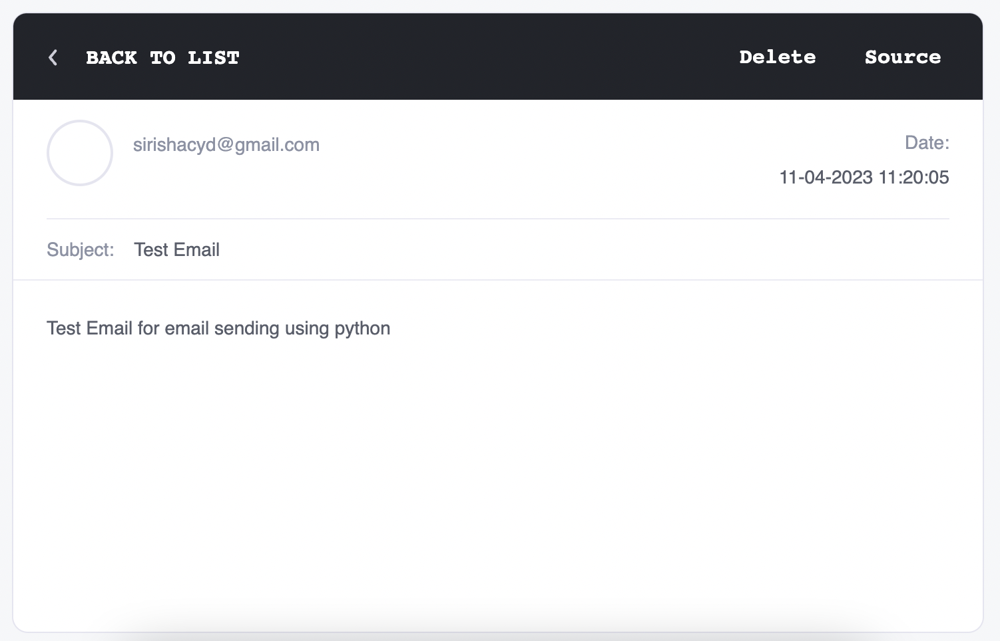
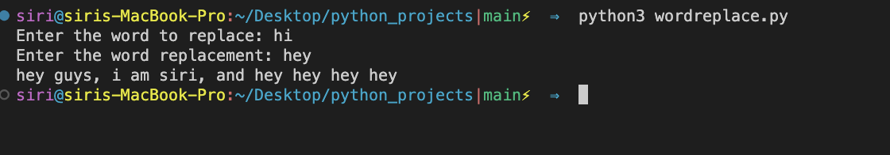
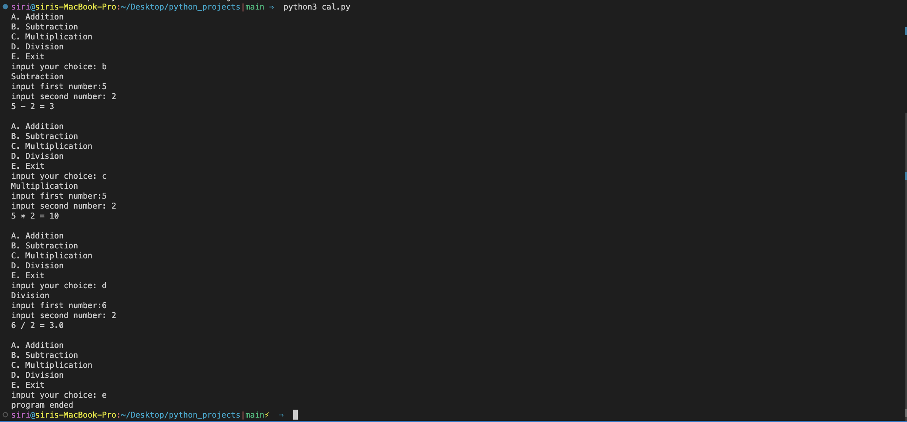
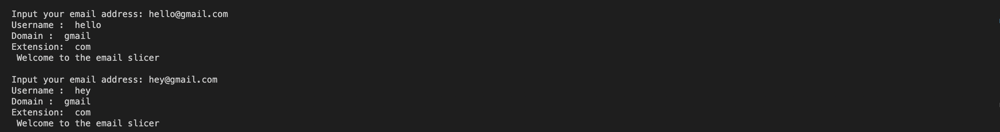
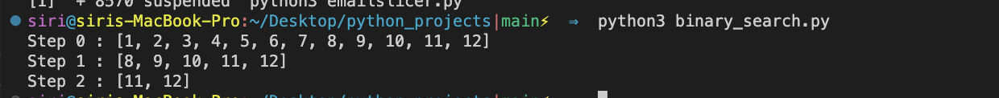
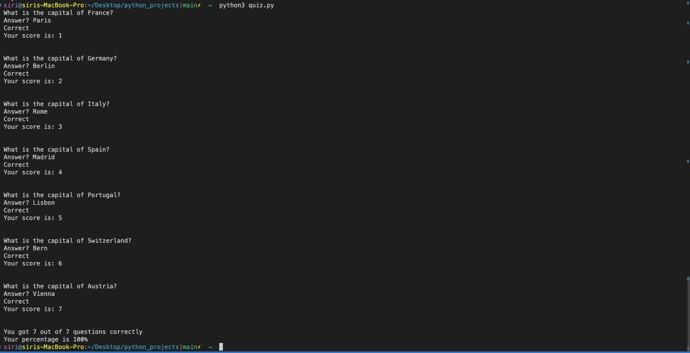

# python_projects

### 1.EmailSender(sending mail with python)

* go to our gmail account  and set up 2 factor authentication
* geneerate password in app
* create a function to send email
* 

### 2.wordreplacement

### 3.Basic calculator
* Define the functions needed:(sub,mul,div)
* print options to the user
* ask for values
* Call the functions
* while loop to continue untill the user wants to exit

### 4.Emailslicer

A program that  takes particular email and it slices into user name and domain

* Collect email from user
* Split the email using the @ the first part as the username , the second part is gonna be saved as domain 
* split domain using '.' 

### 5.BinarySearch

* A funtion that takes a list and target parameter
* multiple variables: middle, start, end , steps 
* we can use recursion or while loop
* Increase the steps each time a split is done
* add the conditions to track target position

### 6.Quiz

* A dictionary that stores questions and answers
* Have a variable that tracks the score of the player
* loop through the dictionary using the key value pairs
* Display each question to the user and allow them to answer 
* If they are right or wrong
* Show the final result when quiz is completed

### 7.QRcode

* Install all the lib's needed
* Create a function that collects a text and convert it to a QR code
* save the QR code as an image
* run the function 

